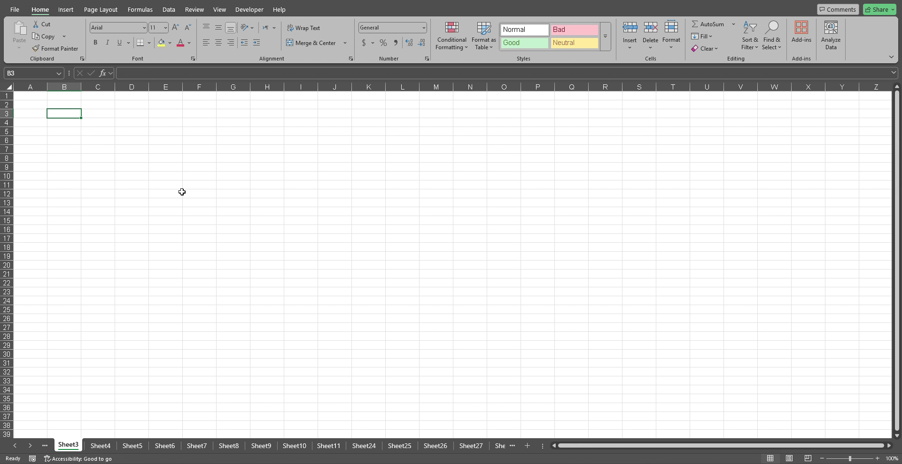

# Excel Sheet Name Search Tool

This VBA tool adds a feature to Excel that allows users to **search through sheet names** — something that is **not available by default** in Excel.

## 🔍 Why This Tool?

Large Excel workbooks can contain dozens or even hundreds of sheets. Excel doesn't provide a built-in way to search for a sheet by its name, which makes navigation difficult and time-consuming.

This tool solves that problem by providing a **custom user form** with:
- A **search box** to type the sheet name (or part of it)
- **Next** and **Previous** buttons to move between matching sheets

## 🚀 How to Use

1. **Open your Excel file** (macro-enabled: `.xlsm`)
2. **Press `ALT + F11`** to open the VBA Editor.
3. **Import the `.bas` and `.frm` files** from this tool into your project.
4. Close the VBA Editor.
5. **Press `ALT + F8`** to run the macro named `ShowSearchForm`.

## 📁 Files Included

- `sheetNameSearchModule.bas` — The main VBA module
- `sheetNameSearch_form.frm` — The user form for search interface
- `sheetNameSearch_form.frx` — Form layout and controls (should be in the same folder as `.frm`)

## 🎬 Demonstration

## 📌 Notes

- The search is **not case-sensitive**
- You can install this macro in your personal macro workbook (`Personal.xlsb`) to make it available in all Excel files
- Requires macros to be enabled

---

Feel free to customize or improve the UI or logic to better suit your workflow. Contributions are welcome!

